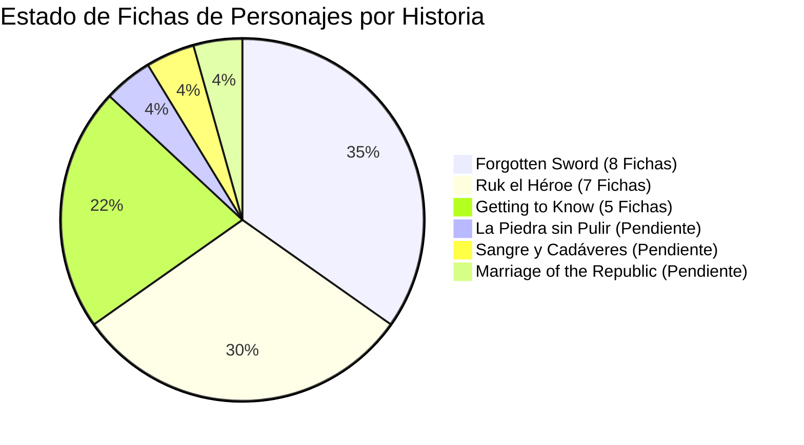

# 📋 Auditoría de Fichas de Personajes — Universo Lignum

Este documento contiene el estado detallado de las **fichas de personajes** para cada una de las 6 obras literarias que integran el **Universo Lignum**.

---

## 🔴 1. Historias Pendientes (Faltan Fichas de Personajes)

Las siguientes **3 historias** no poseen carpeta ni archivos HTML de fichas individuales de personajes creados y se encuentran catalogadas con la insignia **`EN PROCESO DE CREACIÓN`**:

### 1. 💎 **La Piedra sin Pulir**
- **Estado de Fichas**: ❌ **Pendientes (0 / 4)**
- **Detalle**: El portal cuenta con la descripción general de los personajes principales en el menú principal (*El Señor de las Siete Esposas*, *El Campesino de la Verdad*, *Las Siete Esposas*, *Los Veinte Hijos*), pero **no existen las páginas de fichas individuales ilustradas**.
- **Acción sugerida**: Crear la carpeta `la-piedra-sin-pulir/personajes/` y diseñar las fichas de los 4 perfiles.

### 2. 🩸 **Sangre y Cadáveres**
- **Estado de Fichas**: ❌ **Pendientes (0 / N)**
- **Detalle**: No cuenta con sección ni archivos de fichas de personajes en el sitio. La obra se enfoca actualmente en el relato narrativo y la conceptualización.
- **Acción sugerida**: Definir los personajes principales del conflicto escarlata y crear su carpeta `sangre-y-cadaveres/personajes/`.

### 3. 📜 **The Marriage of the Republic**
- **Estado de Fichas**: ❌ **Pendientes (0 / N)**
- **Detalle**: La obra se encuentra en **Fase de Desarrollo y Preparación**, por lo que aún no dispone de fichas de personajes en la web.
- **Acción sugerida**: Diseñar los perfiles de los líderes políticos y diplomáticos una vez estructurado el reparto.

---

## 🟢 2. Historias con Fichas Existentes

Las siguientes **3 historias** ya cuentan con sus archivos HTML de fichas de personajes construidos en el repositorio:

| Historia | Fichas Creadas | Nombres de Personajes Registrados | Estado Visual en Portal |
| :--- | :---: | :--- | :--- |
| **Forgotten Sword** 🗡️ | **8 Fichas** | Ronan, Waldain, Hald, Skaivan, Hlied, Sauri, Deschast, El Rey de Gricái | 🟢 **Publicadas y Accesibles** |
| **Ruk el Héroe** 👑 | **7 Fichas** | Ruk, Kairo, Riav, Orwin, Muvar, Ruval, Tehm | 🔴 Tag *En proceso de creación* (Edición final) |
| **Getting to Know** 🌿 | **5 Fichas** | Derk, Ameřa, Hesis, Heya, Lomen | 🔴 Tag *En proceso de creación* (Edición final) |

---

## 📊 Resumen Estadístico

- **Total de Fichas Existentes**: **20 Fichas de Personajes**
- **Historias con Fichas Listas**: 3 de 6 (50%)
- **Historias Pendientes de Creación**: 3 de 6 (50%)
